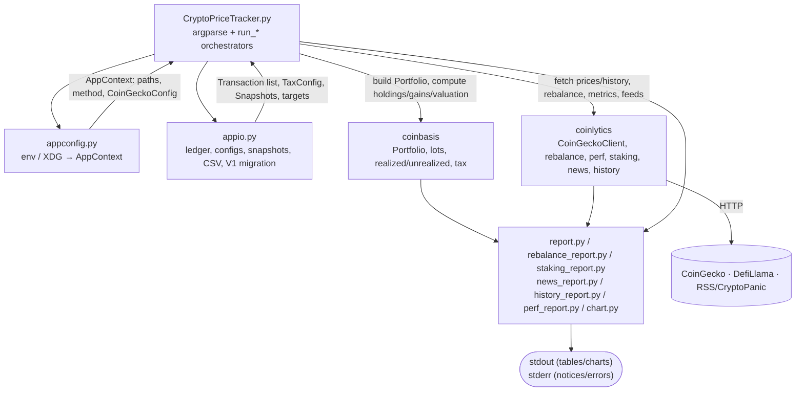

# Architecture

Crypto-Price-Tracker is a thin command-line front-end. The CLI parses arguments,
resolves configuration and files, calls into two reusable packages — `coinbasis`
(cost-basis/tax engine) and `coinlytics` (analytics + market data) — and renders the
returned dataclasses as terminal tables and charts. No accounting or analytics logic
lives in this repository.

## System Diagram

## Component Descriptions

### CLI dispatch & orchestrators
- **Purpose**: Define the argument grammar (12 subcommands + shared global flags) and orchestrate each command.
- **Location**: `CryptoPriceTracker.py` (`build_parser`, `cli`, `_dispatch`, and the `run_*` functions)
- **Key responsibilities**: Build the parser with shared `parent` flags (`--method`, `--select`, `--wallet`, `--year`, `--offline`, `--no-migrate`); route each command to its `run_*` orchestrator; and centralize error handling in `_dispatch`, which maps typed `coinbasis`/`coinlytics` exceptions (e.g. `SelectionRequired`, `RateLimitedError`, `FeedError`) to readable stderr messages and exit codes so no raw traceback reaches the user.

### Configuration (`appconfig.py`)
- **Purpose**: Turn environment variables and CLI flags into a single immutable `AppContext`.
- **Location**: `appconfig.py` (`build_context_from_env`, `AppContext`)
- **Key responsibilities**: The only place env vars are read. Resolves the data directory (`--data-dir` > `CPT_DATA_DIR` > the current directory when it holds a `ledger.json` > the global `~/.config/crypto-price-tracker/`, created on first use) into concrete file paths; builds the `coinlytics.CoinGeckoConfig` (API key/plan from env, XDG cache dir, and a max-TTL cache when `--offline`); and resolves the cost-basis method string to a `coinbasis.CostBasisMethod`, loading a `LotSelection` JSON when `--method specific` is used.

### I/O boundary (`appio.py`)
- **Purpose**: The app's only file/config I/O, including all ledger-schema translation.
- **Location**: `appio.py`
- **Key responsibilities**: Load/save `ledger.json` via `coinbasis.serialization` (atomic writes); detect the legacy V1 flat schema and auto-migrate it to the externally-tagged multi-wallet schema with a `.v1.bak` backup; import transactions from CSV (with dedup and per-row skip notices); and read/write the auxiliary configs (`taxconfig.json`, `targets.json`, `staking.json`, `rewards.csv`, `news.json`) and `snapshots.jsonl`.

### `coinbasis` (cost-basis/tax engine)
- **Purpose**: All cost-basis accounting and tax math.
- **Location**: external PyPI package (`coinbasis>=0.1,<0.2`)
- **Key responsibilities**: `Portfolio.from_transactions` builds portfolio state from the 8-event ledger schema (Buy/Sell/Trade/Income/Spend/Transfer/GiftSent/GiftReceived); exposes holdings, realized gains, unrealized valuation, capital-gains reports, and tax estimates under FIFO/LIFO/HIFO/average/specific lot matching.

### `coinlytics` (analytics + market data)
- **Purpose**: Market-data fetching and portfolio analytics.
- **Location**: external PyPI package (`coinlytics>=0.1,<0.2`)
- **Key responsibilities**: `CoinGeckoClient` fetches prices, sparklines, market caps, and historical series with last-good caching; the `rebalance`, `perf`, `history`, staking, and news modules compute target weights/trades, performance metrics, value reconstruction, staking yields, and sentiment-tagged headlines.

### Formatters & chart primitives
- **Purpose**: Render package dataclasses into terminal output.
- **Location**: `report.py`, `rebalance_report.py`, `staking_report.py`, `news_report.py`, `history_report.py`, `perf_report.py`, `chart.py`
- **Key responsibilities**: Pure functions that take `coinbasis`/`coinlytics` dataclasses and produce aligned text tables, allocation bars, and Unicode sparklines (`chart.sparkline`, `chart.hbar`). They perform no I/O, which keeps them directly unit-testable.

## Data Flow

1. `cli` parses arguments and `_build_ctx` calls `appconfig.build_context_from_env` to produce an `AppContext` (file paths, resolved method, `CoinGeckoConfig`).
2. The chosen `run_*` orchestrator loads the ledger via `appio.load_ledger` (auto-migrating a V1 ledger if needed) and any required config (e.g. `appio.load_taxconfig`, `appio.load_targets`).
3. It builds a `coinbasis.Portfolio` from the transactions and computes holdings/gains/valuation using the resolved method.
4. It fetches live data through a `coinlytics.CoinGeckoClient` (or analytics/feed helpers), tolerating staleness and feed errors as stderr notices.
5. The results are handed to a formatter, which returns a string printed to stdout; diagnostics go to stderr.
6. Time-series commands (`performance`, `history`) append a deduplicated snapshot to `snapshots.jsonl` via `appio.save_snapshots`.

## External Integrations

| Service | Purpose | Notes |
|---------|---------|-------|
| CoinGecko REST API | Live prices, 24h/7d change, sparklines, market caps, historical series | Accessed through `coinlytics.CoinGeckoClient`; keyless-first, optional `COINGECKO_API_KEY`; rate limits surface as `RateLimitedError` and last-good caches keep `--offline` working |
| DefiLlama yields | Staking APY lookup by symbol | Accessed through `coinlytics`; best-effort, falls back to the manual `apy` in `staking.json` on `StakingError` |
| RSS feeds / CryptoPanic | News headlines for sentiment tagging | Accessed through `coinlytics`; unreachable or malformed feeds are skipped (`FeedError`) without failing the command |

## Key Architectural Decisions

### Reusable packages instead of a monolith
- **Context**: The accounting and analytics logic is valuable on its own and was growing beyond what belongs in a single CLI script.
- **Decision**: Extract the cost-basis/tax engine into `coinbasis` and the analytics/market-data layer into `coinlytics`, publish both to PyPI, and depend on them.
- **Rationale**: The engine and analytics can be versioned, tested, and reused independently, while the app stays small and focused on the command-line experience.

### Thin CLI over the libraries
- **Context**: With the logic in packages, the app's job is purely orchestration and presentation.
- **Decision**: Keep `CryptoPriceTracker.py` limited to argument parsing and `run_*` orchestrators that call the packages and hand results to formatters; no business math in the repo.
- **Rationale**: Each command reads as a short, auditable pipeline (load → compute → fetch → format), and the formatters stay pure and testable.

### I/O in the app, logic in the packages
- **Context**: File formats, env wiring, and schema translation are application concerns, not library concerns.
- **Decision**: Concentrate all file/config I/O and ledger-schema translation in `appio.py`, and all env/XDG resolution in `appconfig.py`; the packages receive plain typed inputs.
- **Rationale**: A single I/O boundary makes the data contract explicit and keeps the packages free of filesystem and environment assumptions.

### Automatic V1 ledger migration with a backup
- **Context**: Earlier ledgers used a flat single-wallet schema incompatible with the multi-wallet event model.
- **Decision**: Detect the legacy schema on load and upgrade it in place to the `coinbasis` externally-tagged schema, writing a `.v1.bak` first (`--no-migrate` opts out; `migrate --dry-run` previews).
- **Rationale**: Existing users keep working without manual steps, and the original file is always recoverable.

### Cost-basis method switcher resolved once
- **Context**: Every report needs a consistent lot-matching method, and specific-ID needs an external lot selection.
- **Decision**: Resolve `--method`/`--select` into the `AppContext` a single time, mapping the string to a `coinbasis.CostBasisMethod` and loading a `LotSelection` when specific is chosen.
- **Rationale**: Downstream orchestrators receive a ready-to-use method and never re-parse flags, so FIFO/LIFO/HIFO/average/specific behave identically across commands.

### Centralized typed-error handling
- **Context**: The packages raise typed errors (selection required, insufficient lots, rate limited, feed error) that map to different UX outcomes.
- **Decision**: Catch those exceptions in one `_dispatch` site and translate each to a specific stderr message and exit code (hard-failing on data/price errors, soft-noting feed/staking degradation).
- **Rationale**: Failures are reported at their true cause with actionable messages, and the data table on stdout stays clean for piping.
