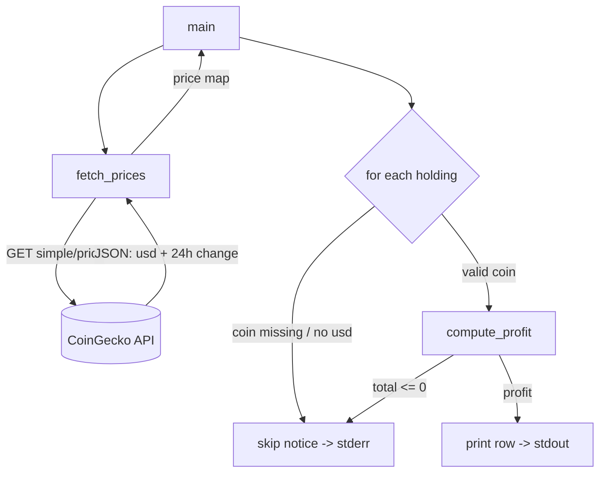

# Architecture

## System Diagram

## Component Descriptions

### `fetch_prices`
- **Purpose**: Retrieve current USD prices and 24h change for all tracked coins in a single call.
- **Location**: `CryptoPriceTracker.py:30`
- **Key responsibilities**: Issue the HTTP GET with a timeout, raise on any non-2xx via `raise_for_status()`, and return parsed JSON. It deliberately does not catch errors — the caller decides how failures are surfaced.

### `compute_profit`
- **Purpose**: Pure function that turns a holding plus a current price into a profit number.
- **Location**: `CryptoPriceTracker.py:38`
- **Key responsibilities**: Compute `(price - average_cost) * total`, and return `None` when the holding total is non-positive so the caller can skip it instead of dividing by zero.

### `main`
- **Purpose**: Orchestrate the run — fetch, then format and print the per-coin table.
- **Location**: `CryptoPriceTracker.py:48`
- **Key responsibilities**: Handle network failure with a clear stderr message and exit code 1; iterate holdings; route diagnostics (skipped coins) to stderr while keeping the data table on stdout.

### Holdings configuration
- **Purpose**: Declare which coins are tracked and their cost basis.
- **Location**: `originalHoldings` dict and `API_URL` in `CryptoPriceTracker.py:5`
- **Key responsibilities**: Single source of truth for what gets fetched and reported; edited directly by the user.

## Data Flow

1. `main` calls `fetch_prices(API_URL)`, which performs one batched CoinGecko request for every coin ID.
2. The response is validated (`raise_for_status`) and parsed to a `{coin_id: {usd, usd_24h_change}}` map.
3. `main` prints the table header, then iterates the holdings dictionary.
4. For each coin it looks up the price; a missing coin or a null/absent `usd` value produces a stderr skip notice and the loop continues.
5. `compute_profit` returns the profit, or `None` for a non-positive total (also skipped with a notice).
6. Valid rows are printed to stdout in an aligned, fixed-width format.

## External Integrations

| Service | Purpose | Notes |
|---------|---------|-------|
| CoinGecko `simple/price` | Live USD prices and 24h change | Public endpoint, no API key; subject to rate limiting (HTTP 429), which is surfaced as a clean error |

## Key Architectural Decisions

### Functions behind a `__main__` guard instead of a flat script
- **Context**: The original tool was a flat top-level script that ran a live HTTP request on import, making it impossible to test.
- **Decision**: Split the work into `fetch_prices`, `compute_profit`, and `main`, executed only under `if __name__ == "__main__":`.
- **Rationale**: This makes the module importable and unit-testable (network and arithmetic can be exercised in isolation) without the weight of turning a one-file utility into a package.

### Skip-and-continue over fail-fast for per-coin data
- **Context**: CoinGecko occasionally renames or delists coin IDs, so a perfectly healthy response can simply omit a coin the user tracks.
- **Decision**: Look coins up defensively (`.get`) and skip any that are absent or lack a usable `usd` price, printing a notice rather than raising.
- **Rationale**: One delisted coin shouldn't blank out the entire portfolio report. The run degrades gracefully and the user still sees every coin that does have data.

### Diagnostics on stderr, data on stdout
- **Context**: The table is useful to redirect or pipe, but skip notices and errors still need to be visible.
- **Decision**: All "skipped" notices and failure messages go to stderr; only table rows go to stdout.
- **Rationale**: `python CryptoPriceTracker.py > table.txt` yields a clean data file while diagnostics remain on the terminal — standard Unix separation.

### Clear failure on network/HTTP errors
- **Context**: A rate-limit or error response is still valid JSON, so naive parsing turns a 429 into a confusing downstream `KeyError`.
- **Decision**: Call `raise_for_status()` and a request timeout inside `fetch_prices`, and catch `requests.RequestException` in `main` to print a message and exit 1.
- **Rationale**: Failures are reported at their real cause (the request) with an actionable message, instead of surfacing as an unrelated crash later in the loop.

### Pure profit function separated from I/O
- **Context**: The profit math needs to be trustworthy and is the easiest place for an off-by-one or divide-by-zero bug.
- **Decision**: Keep `compute_profit` pure (no I/O), returning `None` as the signal for an invalid holding.
- **Rationale**: The arithmetic can be tested directly with plain values, and the zero/negative-total guard lives in one obvious place.
